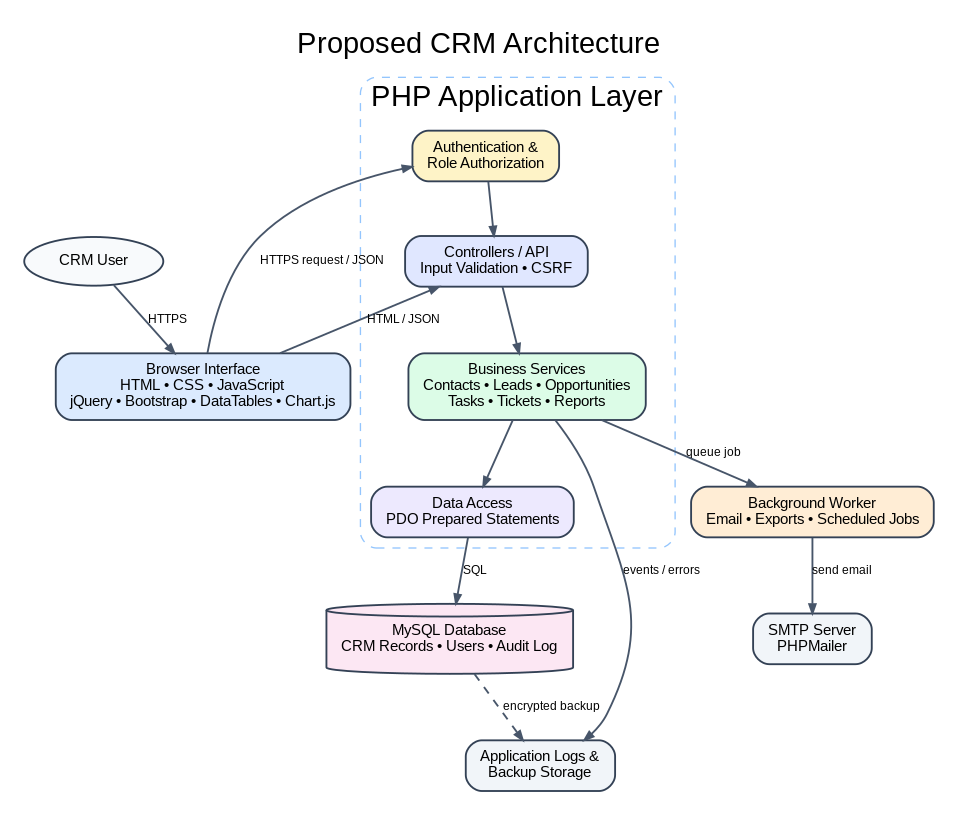

# CRM Research

## Part 1 - AI-Based CRM Discovery

### 1. What is CRM?

Customer relationship management (CRM) is both a business strategy and a software system for managing interactions with current and potential customers. A CRM creates a shared record of customer names, organizations, messages, meetings, purchases, support issues, and sales activity. The purpose is to help employees understand the relationship and decide what should happen next.

#### Purpose

A CRM helps an organization:

- keep customer data in one place;
- give sales, marketing, and support teams the same view;
- track leads from first contact through a closed sale;
- schedule follow-ups and assign work;
- measure pipeline, campaign, and service performance;
- keep a history when an employee changes roles or leaves.

#### History and evolution

CRM developed in stages:

1. **Paper records:** businesses kept customer details in files and card systems such as the Rolodex.
2. **Database marketing in the 1980s:** organizations stored larger customer lists electronically and used them for targeted marketing.
3. **Contact management and sales automation:** products such as ACT! organized contacts, while 1990s sales-force automation systems tracked opportunities and sales work.
4. **Web and cloud CRM:** systems moved from company servers to web-based subscriptions. This made deployment easier and gave mobile workers access.
5. **Integrated customer platforms:** CRM expanded beyond sales into marketing, customer service, commerce, email, and analytics.
6. **AI-assisted CRM:** modern products use AI for lead scoring, forecasting, summaries, recommended actions, and automation.

The progression is from recording customer facts to coordinating work and predicting what action may be useful next.

#### AI research reflection

ChatGPT gave a complete high-level definition and a useful timeline, but the first answer did not clearly separate CRM as a strategy from CRM as software. I corrected that after reading Salesforce's CRM definition and SAP's history. The result was trustworthy for basic concepts after validation, but exact dates and product milestones needed sources.

### 2. Why do organizations use CRM systems?

#### Sales management

Sales teams use CRM to capture leads, assign owners, record calls and meetings, move opportunities through pipeline stages, forecast revenue, and identify deals that have stopped moving.

#### Customer management

A shared contact and account record prevents customer information from being trapped in one person's inbox or spreadsheet. It also gives employees context before a call or meeting.

#### Marketing

Marketing teams segment contacts, manage campaigns, capture responses, and pass qualified leads to sales. A CRM can also connect campaign activity to opportunities and revenue.

#### Customer support

Support teams record cases or tickets, assign responsibility, track status and service history, and view the customer's sales and communication context.

#### Reporting and analytics

Managers use dashboards and reports to answer questions such as: How many new leads arrived? What is the pipeline value? Which campaign produced opportunities? How long do support cases stay open? Which sales stage loses the most deals?

#### AI research reflection

ChatGPT was strong at organizing CRM uses by department. It was less useful when it claimed that every CRM includes every module. Vendor documentation showed that features differ by edition, and some analytics are paid add-ons. I treated the department list as a framework and checked product-specific features separately.

### 3. What business problems do CRM systems solve?

| Industry | Common problem | How a CRM helps | Example |
|---|---|---|---|
| Retail | Customer history is split between stores, ecommerce, and service messages. | Combines contact, purchase, campaign, and support activity. | A store segments customers who bought running shoes and follows up with a relevant campaign. |
| Healthcare | Referral and outreach work can be hard to track across staff. | Assigns outreach, records communication, and reports on follow-up status. | A clinic tracks community-partner referrals without placing detailed clinical records in a general sales CRM. |
| Education | Admissions prospects communicate through forms, email, calls, and events. | Tracks inquiry source, application stage, events, and follow-ups. | An admissions team sees which prospective students attended an open house but have not applied. |
| Manufacturing | Long sales cycles involve distributors, technical contacts, quotes, and many activities. | Links accounts, contacts, opportunities, products, and meetings. | A manufacturer tracks a six-month equipment opportunity and every stakeholder involved. |
| Nonprofits | Donor, volunteer, partner, and program information may live in separate spreadsheets. | Creates shared constituent records and tracks campaigns and activities. | A nonprofit records donor conversations and segments supporters for an annual campaign. |

A CRM does not solve every data problem. Healthcare organizations still need the right clinical systems and privacy controls. A nonprofit may need donation features beyond a basic sales CRM. The system must fit the process and legal requirements.

#### AI research reflection

AI quickly generated industry examples, but some were too confident about regulated healthcare data. I revised the healthcare example to avoid implying that a normal CRM should automatically store clinical records. This topic was useful after human review, but the privacy boundary needed judgment.

### 4. Major CRM modules

| Module | Purpose |
|---|---|
| Contacts | Stores individual people and their communication details. |
| Accounts | Stores companies or organizations and connects their contacts. |
| Leads | Tracks people or organizations that have not yet been qualified. |
| Opportunities | Tracks a possible sale, value, stage, probability, and expected close date. |
| Activities | Keeps a history of calls, meetings, emails, and notes. |
| Tasks | Assigns work and due dates. |
| Marketing Campaigns | Groups outreach, target lists, responses, and campaign results. |
| Support Tickets / Cases | Records customer problems, priority, owner, and resolution status. |
| Reports | Queries CRM data and summarizes results in tables or charts. |
| Dashboards | Places key lists, totals, and charts on a role-specific home page. |
| Users and Roles | Controls who can sign in and what records or actions they can access. |

#### AI research reflection

ChatGPT produced a useful module list. I verified the module meanings against SuiteCRM and EspoCRM documentation. The response was mostly complete, but users and roles were missing from the first answer even though access control is necessary in a multi-user CRM.

## Part 2 - AI-Assisted CRM Product Comparison

Product pages and prices change. The pricing models below were checked on September 14, 2026 and are more useful than a single temporary price quote.

### Commercial CRM products

| Product | Target customer | Strengths | Weaknesses | Pricing model |
|---|---|---|---|---|
| Salesforce Sales Cloud | Mid-size and large organizations, or smaller teams that need a large app ecosystem | Deep lead, account, contact, opportunity, forecasting, automation, API, analytics, and AI options; very large partner ecosystem | Setup and administration can become complex; advanced editions and add-ons raise cost | Subscription by user and edition, with additional products and add-ons |
| HubSpot CRM / Sales Hub | Startups and small to mid-size organizations that value quick adoption and integrated marketing | Free entry point; clean contact and deal management; email, meeting, and marketing connections; easier learning curve | Advanced automation, forecasting, permissions, and customization move into paid tiers; costs can grow with seats and hubs | Free tools plus Starter, Professional, and Enterprise subscriptions, mainly per seat |
| Zoho CRM | Price-conscious small and mid-size businesses, especially teams using other Zoho apps | Broad sales features, workflows, reports, customization, and a free edition for up to three users | Large feature set can make menus and setup feel busy; best experience often depends on the wider Zoho ecosystem | Free edition for three users, then per-user subscription editions |
| Microsoft Dynamics 365 Sales | Mid-size and enterprise organizations already using Microsoft 365, Teams, Power Platform, and Azure | Strong Microsoft integration, reporting, automation, customization, and Copilot options | Implementation and licensing can be difficult; usually needs administration or a partner | Per-user subscriptions by Sales edition, with related Microsoft products and capacity licensed separately |

### Open-source CRM products

| Product | Features | Technology stack | Community support | Ease of installation |
|---|---|---|---|---|
| SuiteCRM | Accounts, contacts, leads, opportunities, campaigns, cases, workflows, dashboards, and built-in reports | PHP; MySQL/MariaDB; Apache or IIS; SuiteCRM 8 adds a modern front end | Long-running project, public code, official docs, releases, and community forum | Medium. The manual LAMP/XAMPP route needs PHP settings and permissions. There is no simple official free Docker image for the current release. |
| EspoCRM | Accounts, contacts, leads, opportunities, cases, email, campaigns, dashboard charts, customization, and REST API | PHP REST backend with a JavaScript single-page front end; MySQL, MariaDB, or PostgreSQL | Active GitHub project, documentation, forum, extensions, and official Docker image | Easy with official Docker Compose; medium manually. Full custom Reports requires the paid Advanced Pack. |
| Odoo Community CRM | Leads, opportunities, activities, pipeline, forecasting, and links to Odoo business modules | Python business layer; HTML/JavaScript/CSS interface; PostgreSQL | Large global Odoo community, public Community Edition, extensive docs and modules | Medium with packages or containers; harder from source because it is a broader ERP platform |

### Analysis and recommendations

#### Which commercial CRM appears most popular?

Salesforce appears most popular by revenue market share. Salesforce's 2026 report cites IDC's April 2026 tracker and says Salesforce held 20.0% of the worldwide CRM market in 2025, ranking first for the thirteenth consecutive year. This is a vendor-hosted summary of IDC data, so I would prefer the full IDC report if making a purchasing decision, but it is strong evidence for the assignment comparison.

#### Which open-source CRM appears most mature?

SuiteCRM appears most mature for a traditional, full-featured open-source CRM. It includes sales, marketing, service, dashboards, workflows, and reports, and it has long-running official documentation and release lines. Odoo is broader and has a large ecosystem, but it is an ERP platform rather than a CRM-only product. EspoCRM has a cleaner official Docker path, but its full Reports feature is in a paid extension.

#### Recommendation for a small business

For a small business that wants the least setup work, I would recommend HubSpot. The free tools let a team test contact and deal management before paying, and the interface is easier to adopt than a large enterprise platform. Before expanding, the company should estimate the cost of the exact paid seats and hubs it will need.

If self-hosting and data control are required, I would recommend SuiteCRM instead. The company must accept responsibility for installation, security updates, backups, and support.

#### Recommendation for a large enterprise

I would recommend Salesforce for a large enterprise that needs a broad platform, advanced customization, partner support, and many integrations. Microsoft Dynamics 365 Sales may be the better choice when the company is already heavily invested in Microsoft 365, Teams, Azure, and Power Platform. The final decision should use a proof of concept with real business processes and a total-cost estimate.

## Part 3 - Open-Source CRM Exploration Plan

### Selected product: SuiteCRM

I selected SuiteCRM because it exposes all five required screens in the open-source product: login, dashboard, contacts, leads, and reports. Its Reports module can query CRM modules and show the results as a table, a chart, or both.

The repository includes two installation paths:

- [Docker evaluation guide](install-guides/docker.md)
- [XAMPP guide](install-guides/xampp.md)

The actual experience cannot be honestly evaluated until the local install is complete. The [open-source evaluation worksheet](open_source_evaluation.md) separates verified product facts from the student's observations. Replace every prompt in brackets after testing.

## Part 4 - AI-Assisted CRM Architecture Exploration

### Functional modules

The proposed CRM should contain:

- Authentication and password reset
- Users, roles, and permissions
- Contacts and accounts
- Leads and lead conversion
- Opportunities and pipeline stages
- Activities, notes, meetings, and tasks
- Support tickets
- Reports and dashboards
- Audit log and administration

### Database design

| Table | Important fields and relationships |
|---|---|
| `users` | id, name, email, password_hash, role_id, status, created_at |
| `roles` | id, name, permissions; one role can belong to many users |
| `accounts` | id, name, industry, phone, website, owner_user_id |
| `contacts` | id, account_id, first_name, last_name, email, phone, owner_user_id |
| `leads` | id, name, company, email, source, status, owner_user_id |
| `opportunities` | id, account_id, name, amount, stage, probability, expected_close_date, owner_user_id |
| `activities` | id, type, subject, starts_at, completed_at, owner_user_id; related to a CRM record through a controlled relation |
| `tasks` | id, title, due_at, status, assigned_user_id, related_record |
| `tickets` | id, contact_id, account_id, subject, priority, status, assigned_user_id |
| `campaigns` | id, name, channel, starts_at, ends_at, budget, status |
| `campaign_members` | campaign_id, contact_id or lead_id, response_status |
| `notes` | id, body, author_user_id, related_record, created_at |
| `audit_logs` | id, user_id, action, entity_type, entity_id, created_at, metadata |

Foreign keys and indexes should support common lookups, such as contacts by account, open opportunities by owner and stage, and activities by due date. Sensitive data should be limited to what the business actually needs.

### Useful libraries

| Library | Purpose |
|---|---|
| Bootstrap | Responsive layout, forms, navigation, modals, and common interface components |
| jQuery | DOM events and AJAX requests, especially because the required stack names it |
| DataTables | Searchable, sortable, paginated tables for contacts, leads, and reports |
| Chart.js | Bar, line, pie, and doughnut charts for pipeline and dashboard metrics |
| PHPMailer | SMTP email for password resets, assignments, and notifications |
| Composer | PHP dependency management and locked package versions |

Libraries save time but also create update work. Versions should be pinned, security notices monitored, and unused packages removed.

### Security considerations

#### Authentication

Use server-side sessions, HTTPS, secure and HTTP-only cookies, session rotation after login, login throttling, and password reset tokens that expire and can be used only once.

#### Authorization

Authentication answers “who is the user?” Authorization answers “what can this user do?” Check permissions on the PHP server for every read and write. Hiding a button in JavaScript is not access control. Roles might include administrator, sales manager, sales representative, support agent, and read-only user.

#### Password security

Store passwords with PHP's `password_hash()` and verify them with `password_verify()`. Never store plaintext passwords or create a custom password-encryption method.

#### SQL injection prevention

Use PDO prepared statements with bound parameters. Validate allowed sort columns and directions instead of inserting raw request text into SQL. The database account should receive only the permissions the application needs.

#### Cross-site scripting prevention

Escape untrusted text when rendering HTML, validate rich text, use a Content Security Policy, and avoid placing raw user content into `innerHTML`. Output encoding depends on context, so HTML, attributes, URLs, and JavaScript require the right handling.

#### Data privacy

Collect only needed customer information, define retention rules, log access to sensitive actions, encrypt traffic, protect backups, and provide export/deletion workflows where required. Permissions should prevent employees from browsing records outside their job.

#### Additional controls

Use CSRF tokens on state-changing requests, validate uploaded files, keep PHP and libraries patched, record audit events, back up the database, and test restore procedures.

### MVP proposal

The smallest useful Version 1 would include:

1. Sign in and role-based permissions.
2. Create, edit, search, and assign accounts and contacts.
3. Create and qualify leads.
4. Convert a lead into a contact, account, and opportunity.
5. Move opportunities through a small pipeline.
6. Add tasks, notes, and follow-up dates.
7. Show a dashboard with open leads, pipeline by stage, overdue tasks, and expected revenue.
8. Export a simple CSV report.
9. Record an audit log for major create, update, and delete actions.

Marketing automation, email synchronization, advanced forecasting, customer portals, and AI scoring should wait until the core records and permissions work reliably.

### Architecture diagram explanation

The browser renders Bootstrap pages and sends HTTPS requests. PHP controllers authenticate requests and call service classes. The service layer applies business rules and uses repositories with prepared SQL statements. MySQL stores CRM records. A background worker handles slow jobs such as email and exports. Logs and audit records support troubleshooting and accountability.

