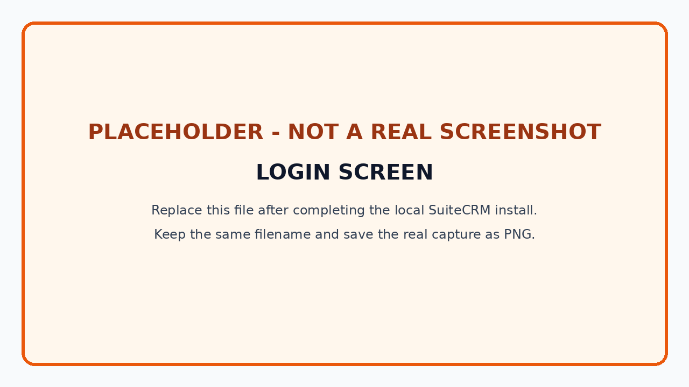
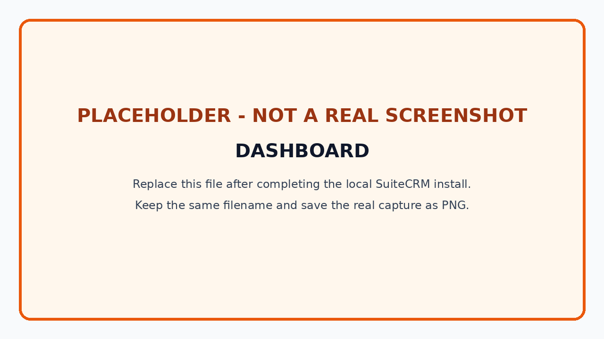
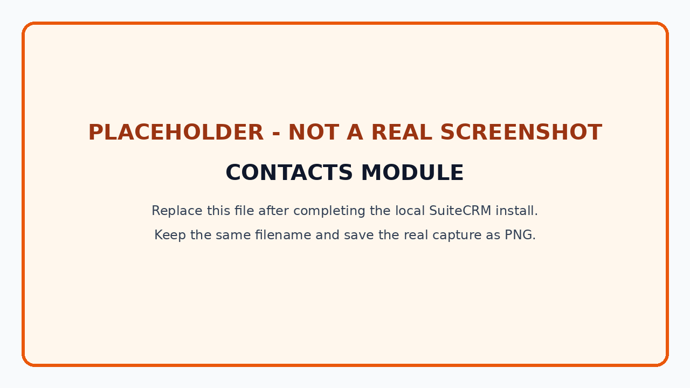
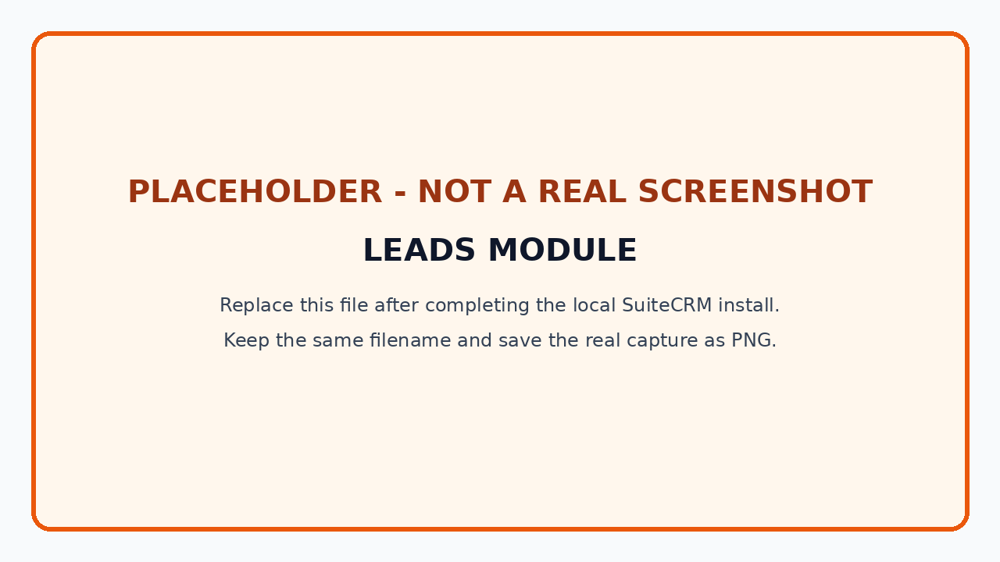
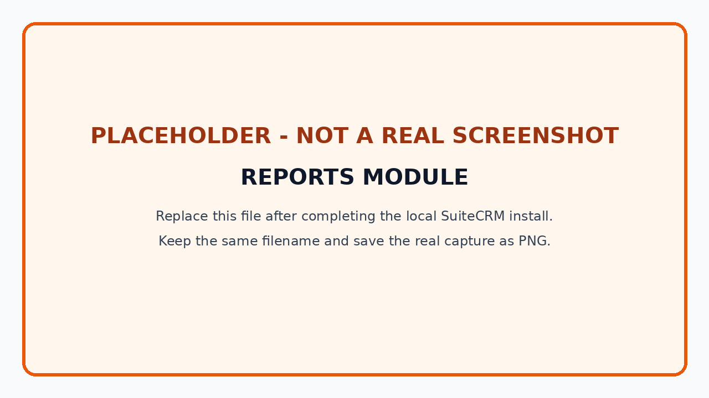

# Open-Source CRM Evaluation Worksheet

## Selected Product

**SuiteCRM**

## Why SuiteCRM Was Selected

SuiteCRM includes Contacts, Leads, dashboards, and a built-in Reports module, matching all five required screenshots. Its open-source edition can also be installed locally with a PHP and MySQL/MariaDB stack.

## Installation Experience

Complete this section after doing the local install.

- **Method used:** [Docker or XAMPP]
- **SuiteCRM version shown in the application:** [replace]
- **Approximate installation time:** [replace]
- **Was installation easy?** [replace with your own answer]
- **Challenges that occurred:** [replace with the exact issue, or write “No major issue”]
- **How AI helped:** [replace with what you actually asked and whether the fix worked]

Do not claim that both methods were installed if only one was tested.

## Product Experience

Complete this section after exploring the real interface.

### Features that impressed me

[Write 2-4 observations tied to screens you actually opened. Examples to examine: configurable dashlets, lead conversion, the Contacts history view, or report charts.]

### Features that were missing or difficult

[Write 1-3 real limitations you noticed. Do not copy a review.]

### Would I use it in a real organization?

[Answer yes, no, or only in a specific situation. Discuss data control, setup/maintenance effort, user experience, needed integrations, and support.]

## Required Screenshots

Replace each placeholder file with a real PNG from the local instance. Do not crop out the page title. Do not expose a real password, personal customer data, browser bookmarks, or unrelated tabs.

### 1. Login screen

**What I observed:** [replace after capturing]

### 2. Dashboard

**What I observed:** [replace after capturing]

### 3. Contacts module

**What I observed:** [replace after capturing]

### 4. Leads module

**What I observed:** [replace after capturing]

### 5. Reports or analytics module

**What I observed:** [replace after capturing]

## Screenshot Completion Checklist

- [ ] `screenshots/login.png` is a real login screen
- [ ] `screenshots/dashboard.png` is a real dashboard
- [ ] `screenshots/contacts.png` shows the Contacts module
- [ ] `screenshots/leads.png` shows the Leads module
- [ ] `screenshots/reports.png` shows the Reports module
- [ ] No screenshot contains passwords or private customer data
- [ ] Every bracketed observation above has been replaced
